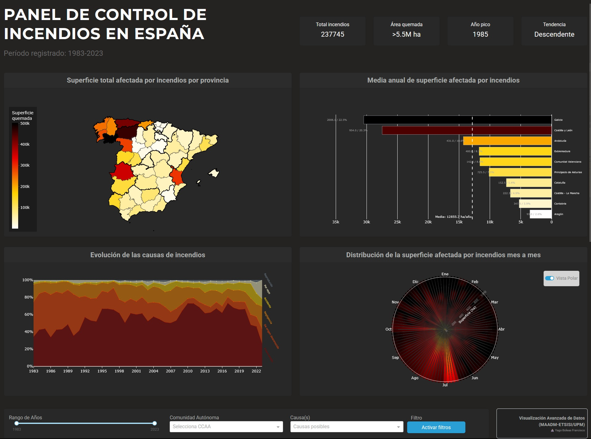
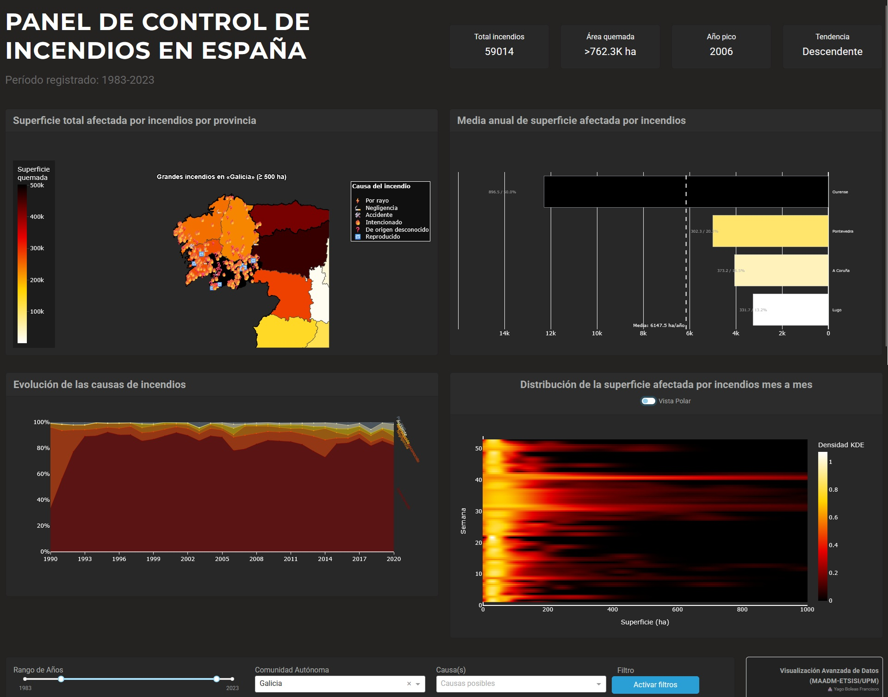

<div align="center">

# 🔥 Incendios Forestales en España (1983-2023)
  [](https://python.org)
  [](https://docs.astral.sh/uv/)
  [](https://github.com/psf/black)
  [](https://pycqa.github.io/isort/)
  [](https://dash.plotly.com/)
  [](https://pola.rs/)
  [](LICENSE)
</div>

Dashboard interactivo para la exploración y visualización de datos históricos de incendios forestales en España. Analiza más de **40 años de datos** sobre incendios, sus causas, impacto territorial y evolución temporal.


---

## 📋 Tabla de Contenidos

- [Características](#-características)
- [Capturas de Pantalla](#-capturas-de-pantalla)
- [Instalación](#-instalación)
- [Uso](#-uso)
- [Estructura del Proyecto](#-estructura-del-proyecto)
- [Datos](#-datos)
- [Tecnologías](#-tecnologías)
- [Licencia](#-licencia)

---

## ✨ Características

### Visualización Geográfica
- **Mapa coroplético** de España por provincias con superficie quemada
- **Zoom interactivo** por Comunidad Autónoma
- **Marcadores de grandes incendios** (>500 ha) con información detallada

### Análisis de Causas
- **Gráfico de áreas apiladas** con evolución porcentual de causas
- Clasificación: Rayo ⚡ | Negligencia 🚬 | Accidente 🛠️ | Intencionado 🔥 | Desconocido ❓ | Reproducido 🔁

### Comparativas Regionales
- **Rankings** de comunidades y provincias por superficie afectada
- Análisis de **medias anuales** y tendencias

### Filtros Interactivos
- Selección de **rango de años** (1983-2023)
- Filtrado por **Comunidad Autónoma**
- Filtrado por **causas de incendio**
- **KPIs dinámicos**: total incendios, superficie quemada, tendencia

---

## 📸 Capturas de Pantalla

### Dashboard principal



Cuando no se selecciona ningún filtro para el gráfico se puede observar la interfaz base. En esta se calculan todos los gráficos y KPIs respecto al total de los datos. Se pueden observar los siguientes componentes:
  1. **KPIs**: información relevante sobre el territorio. Aparecen los siguientes cuadros:
      - Número total de incedios desde el 1 de enero de 1983 hasta el último día disponible en el dataset, el 8 de diciembre del 2023.
      - Área quemada en el tiempo seleccionado
      - Año de los disponibles en el que más superficie se quemó
      - Tendencia del último año respecto al anterior en número total de incendios

  2. **Mapa del territorio**: muestra la superficie total afectada por incendios en cada provincia española. Utiliza una escala de colores donde los tonos más oscuros indican mayor superficie quemada, permitiendo identificar rápidamente las zonas más castigadas.
  
  3. **Ranking de superficie afectada**: gráfico de barras horizontal que visualiza la media anual de superficie quemada. Sin filtros aplicados, compara las Comunidades Autónomas para identificar cuáles sufren incendios de mayor magnitud en promedio. Muestra el top 10 de las comunidades más afectadas. Cada barra muetra información adicional cuando se pasa el ratón por encima.

  4. **Evolución de causas**: gráfico de áreas apiladas que representa la variación de las causas de los incendios a lo largo de los años. Facilita la observación de tendencias temporales en el origen de los siniestros.

  5. **Distribución estacional**: gráfico polar que muestra la superficie quemada distribuida mes a mes. Permite identificar claramente la estacionalidad de los incendios, destacando visualmente la campaña de alto riesgo (meses de verano). Se puede seleccionar también visualizar el gráfico como un mapa de calor convencional.

  6. **Panel de filtros**: situado en la parte inferior, permite personalizar el análisis mediante:
      - **Rango de años**: slider para seleccionar el periodo de estudio.
      - **Comunidad Autónoma**: desplegable para centrar el análisis en una región específica (haciendo zoom en el mapa y filtrando el resto de gráficos).
      - **Causa**: desplegable para filtrar los datos por el origen del incendio. 

### Dashboard con filtros aplicados



En este ejemplo se muestra el estado del dashboard al seleccionar un **rango de años** (no un año único) y filtrar por una **Comunidad Autónoma** específica. La interfaz responde de la siguiente manera:

1. **Zoom y detalle en el mapa**: El mapa se centra automáticamente en la comunidad seleccionada. Se activan capas adicionales que muestran la ubicación exacta de todos los **grandes incendios (>500 ha)** representados con iconos, permitiendo explorar eventos singulares de gran impacto. Cada incendio mostrado en el mapa permite visualizar una mínima información propia cuando se pasa por encima el ratón. El resto de filtros (rango de años y causas de los incendios) **no afectan** en esta visualización.

2. **Recontextualización de los gráficos**:
   - El **Ranking** cambia de nivel jerárquico: deja de comparar comunidades para comparar las **provincias** que componen la comunidad seleccionada, ofreciendo una granularidad más fina.
   - El **Gráfico de causas** y el **Gráfico estacional** se recalculan utilizando únicamente los datos filtrados, permitiendo analizar los patrones específicos de esa región durante el periodo elegido (por ejemplo, si en esa zona predominan los incendios intencionados o por negligencia).

3. **KPIs Específicos**: Los indicadores de la parte superior reflejan exclusivamente las estadísticas de la selección, permitiendo dimensionar el problema a nivel regional.

---

## 🚀 Instalación

### Prerrequisitos
- Python 3.13 o superior
- [uv](https://docs.astral.sh/uv/) (recomendado) o pip

> [!IMPORTANT]
> Para la gestión de dependencias y entornos virtuales se utiliza **[uv](https://docs.astral.sh/uv/)**, un gestor de paquetes extremadamente rápido escrito en Rust.
> 
> Si no dispones de `uv`, instálalo ejecutando:
> ```bash
> # En macOS/Linux
> curl -LsSf https://astral.sh/uv/install.sh | sh
>
> # En Windows
> powershell -ExecutionPolicy ByPass -c "irm https://astral.sh/uv/install.ps1 | iex"
> ```

### Opción 1: Con uv (Recomendado)


```bash
# Clonar el repositorio
git clone https://github.com/yabol02/VAD.git
cd VAD

# Crear entorno virtual e instalar dependencias
uv sync
```

### Opción 2: Con pip

```bash
# Clonar el repositorio
git clone https://github.com/yabol02/VAD.git
cd VAD

# Crear entorno virtual
python -m venv .venv

# Activar entorno (Windows)
.venv\Scripts\activate

# Activar entorno (Linux/Mac)
source .venv/bin/activate

# Instalar dependencias
pip install -e .
```

---

## 💻 Uso

Para ejecutar el fichero, ejecutar uno de los siguientes comandos:

```bash
# Con uv
uv run python main.py

# Con pip (entorno activado)
python main.py
```

Abre tu navegador en **http://127.0.0.1:8050**

---

## 📁 Estructura del Proyecto

```
VAD/
├── 📄 main.py              # Aplicación Dash principal
├── 📄 plots.py             # Funciones de visualización (Plotly)
├── 📄 processing.py        # Procesamiento de datos (Polars/GeoPandas)
├── 📄 utils.py             # Utilidades y constantes
├── 📓 exploracion.ipynb    # Análisis exploratorio y propuestas de gráficos
├── 📄 pyproject.toml       # Configuración del proyecto
├── 📄 README.md
├── 📄 LEEME.md
└── 📂 data/
    ├── fires_all.csv              # Dataset de incendios
    └── provincias_espana.geojson  # Geometrías provinciales
```

---

## 📊 Datos


Los datos provienen de [Civio](https://datos.civio.es/), organización dedicada al periodismo de datos:

| Dataset | Descripción | Enlace |
|---------|-------------|--------|
| **Incendios Forestales** | Todos los incendios en España (1963-2023) | [🔗 Enlace](https://datos.civio.es/dataset/todos-los-incendios-forestales/) |
| **Mapa Interactivo** | Visualización original de Civio | [🔗 Enlace](https://civio.es/medio-ambiente/mapa-de-incendios-forestales/) |
| **Provincias de España** | Ubicación de los límites de las provincias de España | [🔗 Enlace](https://gist.github.com/josemamira/3af52a4698d42b3f676fbc23f807a605?short_path=45ec3d9) |

---

## 🛠️ Tecnologías

| Tecnología | Uso |
|------------|-----|
|  | Lenguaje principal |
|  | Framework web/dashboard |
|  | Visualizaciones interactivas |
|  | Procesamiento de datos |
|  | Datos geoespaciales |
|  | Estilos (Cyborg theme) |

---

## 📝 Licencia

Este proyecto está bajo la Licencia MIT. Consulta el archivo [LICENSE](LICENSE) para más detalles.

---

<a href="https://www.etsisi.upm.es/">
  </img>
</a>
<p align="center">
  <sub>👨🏻‍💻 Yago Boleas Francisco (<a href="https://github.com/yabol02">@yabol02</a>)</sub>
</p>